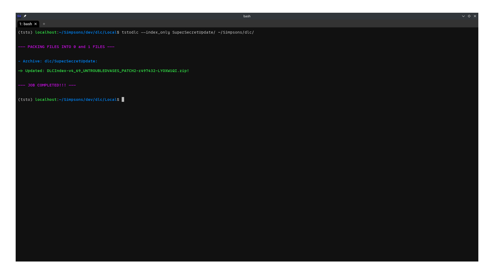
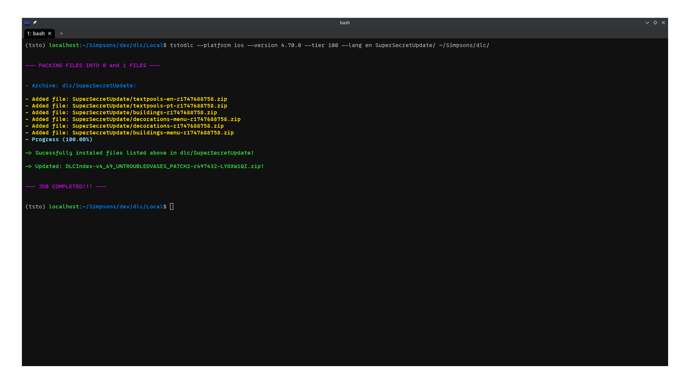
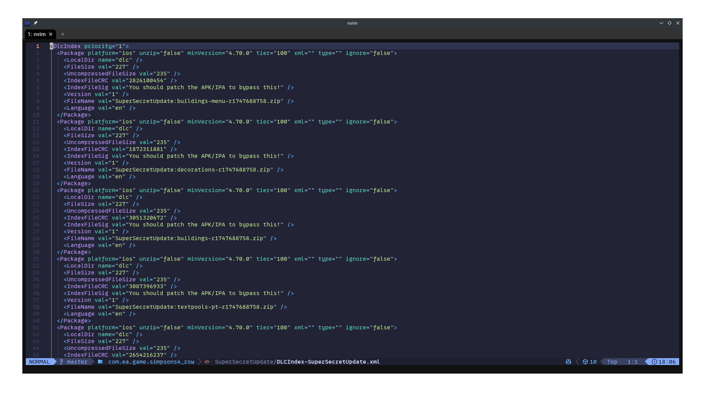
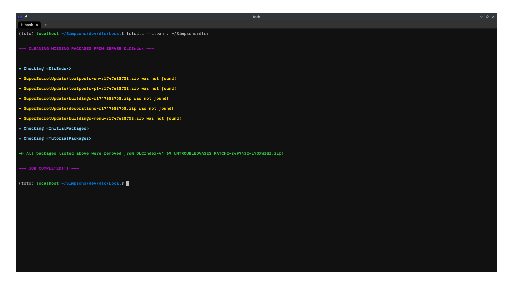
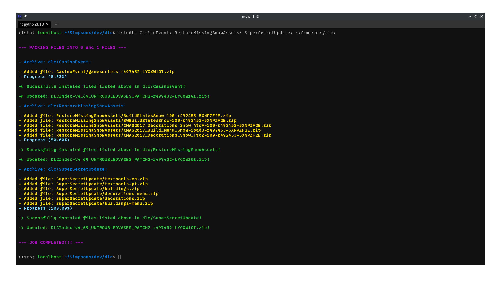

# Create and install dlcs in your TSTO server

This tool allows you to pack dlcs and implement them into your TSTO server.
It will pack your files into the required 0 and 1 files, zip and copy them over
to your server dlc repository (or whatever place you point it to)
and automatically update the required index files so the game will
download them once you log into your server.

**Highlighted main features:**

* install multiple dlcs at once;
* update dlc attributes and parameters at anytime;
* update only files that have been changed to avoid repeated long installation times;
* auto update server index files to include or remove packages;

## Installation

First, make sure you have [**python**](https://www.python.org/downloads/)
and [**git**](https://git-scm.com/downloads) installed on your system.

With those requirements satisfied, run either of the following commands in the command-line interface to install tstodlc, according to your OS:

* Windows installation command.

```
python -m pip install tstodlc@git+https://github.com/al1sant0s/tstodlc
```

* Linux installation command.

```
python3 -m pip install tstodlc@git+https://github.com/al1sant0s/tstodlc
```

You will also need to patch an apk/ipa to bypass IndexFileSig. For that you can use this [**patcher**](https://github.com/al1sant0s/Tsto_patcher).

## Basic usage

To get the full help execute the following command:

```shell
tstodlc --help
```

The tool will receive a list of directories (those being the dlcs) and will install them on the last directory you provide (that should be
the server dlc repository).

## Introduction

Before you can use the tool you first have to make sure that your dlcs follow a basic structure.
Basically, you should have a directory with the name of your dlc and within
that directory you should have subdirectories that each correspond to a specific component of your dlc.

For example, suppose you are creating a dlc and want to name it _SuperSecretUpdate_. You decide that this dlc
will bring along: textpools for two languages (Portuguese and English), some buildings, some decorations and the necessary
menu icons for those last two.

Then, in your working directory you will have your dlc structure similar to the following scheme:

* SuperSecretUpdate/
  * buildings/
  * decorations/
  * buildings-menu/
  * decorations-menu/
  * textpools-pt/
  * textpools-en/


Do notice that the names of the root directory (dlc directory) and subdirectories (dlc components)
do not matter and you can name them to whatever you wish to.

In those subdirectories you will place the files you need to.
For example: the buildings, decorations and menu subdirectories will probably contain rgb,
bsv3 and xml files. It's up to you to decide which files should go on which places.

After you have done the manual job of creating and adding the required files to compose your dlc,
it's time to pack the files and install them onto your server. This is as simple as running the following
command on the command-line interface:

```shell
tstodlc /path/to/SuperSecretUpdate/ /path/to/server/dlc/
```

Once this command is ran, a file called **DLCIndex-SuperSecretUpdate.xml** will be created under **/path/to/SuperSecretUpdate/.**
In this file you will be able to edit the dlc packages entries and update the index from the server.
This will be explained better in the next sections.


In this situation you would replace **/path/to/SuperSecretUpdate/** with the real relative or absolute directory path
to your dlc folder, in this example named to _SuperSecretUpdate_. Similarly, **/path/to/server/dlc/** would refer to
the actual path to your server dlc repository (the places where all the dlcs are).

If you do this correctly, a new directory under /path/to/server/dlc/ will be created with the same name you've used for your dlc
directory, in this example a new directory named _SuperSecretUpdate/_ would be made. The subdirectories would be zipped and placed into
this new directory. Finally, the tool will find and update the necessary **DLCIndex-XXXX.zip** file.

## Updating package entries

Let's make some things clear. We will refer to two kinds of files here, DLCIndex.zip and DLCIndex-XXXX.zip
(the extra X's are just a placeholder for whatever comes after the dash).

If we wish to get into more details, we need to explain how the game retrieves dlcs from the server. When the game starts connecting to the server
it will request several things. Among those things is a file called **DLCIndex.zip**, this file defines a lot of stuff and points to another file
called **DLCIndex-XXXX.zip** (again the X's here are just a placeholder for whatever comes after the dash). The dlcs your game will actually download
are defined in a list contained in the file DLCIndex-XXXX.zip. So for a new dlc to be recognized by the server and to be downloaded by your game, it
needs to be defined within this list as well.

That means that for the game to recognize the dlcs, each dlc component needs to be
written as a package entry onto the aforementioned DLCIndex-XXXX.zip file.
As explained before, the tool will do this automatically for you
(as long as you have directed the tool to install the dlc onto the server dlc repository).

However, since the tool does not know which settings to apply for those package
entries, it will write them with some default values. If you wish to easily
update those values you can, by editing the _DLCIndex-NameOfYourDlcDirectory.xml_ file that will be made into your
original dlc directory once you install the dlc.

In the context of the example that we are showing, the previous file will be named **DLCIndex-SuperSecretUpdate.xml**.
You will have the following scheme now, just after running the previous command to install the SuperSecretUpdate dlc:

* SuperSecretUpdate/
  * buildings/
  * decorations/
  * buildings-menu/
  * decorations-menu/
  * textpools-pt/
  * textpools-en/
  * DLCIndex-SuperSecretUpdate.xml

You can then edit the attributes and parameters in DLCIndex-SuperSecretUpdate.xml and
save it.


After that, just run the following command to update the values in
the server DLCIndex-XXXX.zip file.

```shell
tstodlc --index_only /path/to/SuperSecretUpdate /path/to/server/dlc/
```



Whatever is specified in DLCIndex-SuperSecretUpdate.xml will be written onto DLCIndex-XXXX.zip.

The **--index_only** argument here is optional. It will tell tstodlc to just update DLCIndex-XXXX.zip
file and not reinstall any dlcs again. If --index_only was not specified, tstodlc
**would still check** if dlc files have changed since last usage and only then it would reinstall
the changed dlc components.  Regardless, DLCIndex-XXXX.zip file would still be updated to include anything new
from DLCIndex-SuperSecretUpdate.xml.

## Specifying some predefined values for package entries

If you know beforehand some of the attributes each package entry will share, like platform, tier or anything similar,
you can specify them during the installation of your dlc. For example, the following command will install your dlcs
and specify each package entry with **platform: ios**, **minVersion: 4.70.0**, **tier: 100** and **language: en** (English).

```shell
tstodlc --platform ios --version 4.70.0 --tier 100 --lang en /path/to/SuperSecretUpdate /path/to/server/dlc/
```



Beware that these arguments will overwrite their values in DLCIndex-SuperSecretUpdate.xml (if that file exists off course).
Also, they don't work together with --index_only.
Bellow is the result from running the previous command:



## Tutorial and Initial Packages

Use --tutorial and --initial to place your dlc packages within _TutorialPackages_ and _InitialPackages_ sections in DLCIndex-XXXX.zip.

```shell
tstodlc --initial /path/to/SuperSecretUpdate /path/to/server/dlc/
```

```shell
tstodlc --tutorial /path/to/SuperSecretUpdate /path/to/server/dlc/
```

## Priority

If your dlcs happen to define files with the same names as other already existing dlcs, the game will have to choose one of them to use. For instance, suppose your dlc defines a file called mybuilding.rgb
and this file is already defined by another existing dlc in the server dlc repository.

You can force the game to use the files from your dlc by specifying a priority positive number with --priority.
This only works if the value you give to --priority is greater than the value associated with the other file in the other dlc.
These values are defined in the 0 files from each dlc component.

So if for example you know that mybuilding.rgb has associated with it a value of 2600,
you can use the following command to have the game use your mybuilding.rgb file:

```shell
tstodlc --priority 2601 /path/to/SuperSecretUpdate /path/to/server/dlc/
```

Any value greater than 2600 would have effect in this case. Beware that these priority values are defined in the 0 file of a dlc component,
and this will apply to all the dlc components in this case.
So all the files under buildings/, buildings-menu/, decorations/, decorations-menu/, textpools-pt/, textpools-en/
will all get the same priority value of 2601 as a consequence of the execution of the previous command.

Two more things to consider. One, if not specified default priority value used during dlc installation is 1.
Two, every time you specify --priority tstodlc will reinstall your dlcs, no matter if any files have been changed or not.
This is a way to guarantee you are able to update priority values from dlcs that already have been installed.

## Unzip

tstodlc will pack each dlc component as a zip file. To prevent this behaviour, use --unzip argument. This might be useful for editing apk and ipa internal files.

```shell
tstodlc --unzip /path/to/SuperSecretUpdate /path/to/server/dlc/
```

This will copy each dlc component folder over the destination.

## Uninstalling dlcs

Uninstalling dlcs from the server dlc repository is as easy as installing them and it's done using the --clean argument.
First, either remove (move it, rename it or delete it) the entire dlc directory under the server
dlc repository or some of its dlc components (the zip files inside the folders). After that run the following command  to update the server DLCIndex-XXXX.zip file:

```shell
tstodlc --clean . /path/to/server/dlc/
```



## Installing multiple dlcs at once

Installing multiple dlcs at once is possible and really simple as shown in the image bellow.



The command you use in this situation is the following one:

```shell
tstodlc /path/to/dlc01/ /path/to/dlc02/ path/to/dlc03/ /path/to/dlcN/ /path/to/server/dlc/
```

The first N directories are the dlcs you want to install and the last one as usual is where they will be installed.
After the command is executed, under each /path/to/dlcXX/ an index file will be created so you can edit their correspondent packages entries.
All previous options discussed earlier work here as well.
