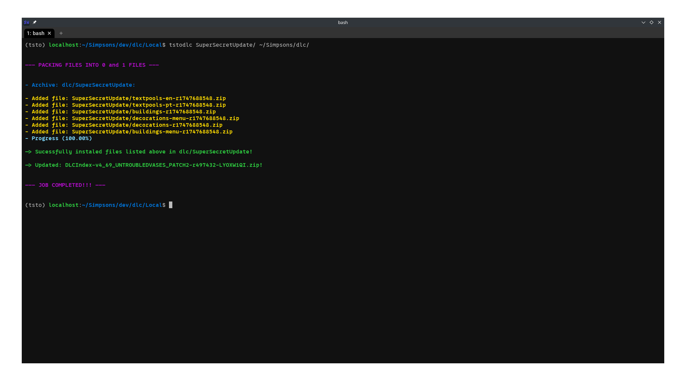

# Create and install dlcs in your TSTO server

This tool allows you to pack dlcs and implement them into your TSTO server.
It will pack your files into the required 0 and 1 files, zip and copy them over
to your server dlc repository (or whatever place you point it to)
and automatically update the required index files so the game will
download them once you log into your server.

## Basic usage

Before you can use the tool you first have to make sure that your dlcs follow a basic structure.
Basically, you should have a directory with the name of your dlc and within
that directory you should have subdirectories that each correspond to a specific component of your dlc.

For example, suppose you are creating a dlc and want to name it SuperSecretUpdate. You decide that this dlc
will bring with it: textpools for two languages (portuguese and english), some buildings, some decorations and the necessary
menu icons for those last two.

Then, in your working directory you will have your dlc structure similar to the following scheme:

* SuperSecretUpdate/
  * buildings/
  * decorations/
  * buildings-menu/
  * decorations-menu/
  * textpools-pt/
  * textpools-en/


Do notice that the names of the root directory (dlc directory) and subdirectories (dlc components)
do not matter and you can name them to whatever you wish to.

In those subdirectories you will place the files you need to.
For example: the buildings, decorations and menu subdirectories will probably contain rgb,
bsv3 and xml files. It's up to you to decide which files should go on which places.

After you have done the manual job of creating and adding the required files to compose your dlc,
it's time to pack the files and install them onto your server. This is as simple as running the following
command on the command-line interface:

```shell
tstodlc /path/to/SuperSecretUpdate/ /path/to/server/dlc/
```

Once this command is ran, a file called DLCIndex-SuperSecretUpdate.xml will be created under /path/to/SuperSecretUpdate/.
In this file you will be able to edit the dlc packages entries and update the index from the server.
This will be explained better in the next sections.



In this situation you would replace **/path/to/SuperSecretUpdate/** with the real relative or absolute directory path
to your dlc folder, in this example named to _SuperSecretUpdate_. Similarly, **/path/to/server/dlc/** would refer to
the actual path to your server dlc repository (the places where all the dlcs are).

If you do this correctly, a new directory under /path/to/server/dlc/ will be created with the same name you've used for your dlc
directory, in this example a new directory named _SuperSecretUpdate_ would be made. The subdirectories would be zipped and placed into
this new directory. Finally, the tool will find and update the necessary **DLCIndex-XXXX.zip** file.

## Updating package entries

Let's make some things clear. We will refer to two kinds of files here, DLCIndex.zip and DLCIndex-XXXX.zip
(the extra X's are just a placeholder for whatever comes after the dash).

If we wish to get into more details, we need to explain how the game retrieves dlcs from the server. When the game starts connecting to the server
it will request several things. Among those things is a file called **DLCIndex.zip**, this file defines a lot of stuff and points to another file
called **DLCIndex-XXXX.zip** (again the X's here are just a placeholder for whatever comes after the dash). The dlcs your game will actually download
are defined in a list contained in the file DLCIndex-XXXX.zip. So for a new dlc to be recognized by the server and to be downloaded by your game, it
needs to be defined within this list as well.

That means that for the game to recognize the dlcs, each dlc component needs to be
written as a package entry onto the aforementioned DLCIndex-XXXX.zip file.
As explained before, the tool will do this automatically for you
(as long as you have directed the tool to install the dlc onto the server dlc repository).

However, since the tool does not know which settings to apply for those package
entries, it will write them with some default values. If you wish to easily
update those values you can, by editing the _DLCIndex-NameOfYourDlcDirectory.xml_ file that will be made into your
original dlc directory once you install the dlc.

In the context of the example that we are showing, the previous file will be named **DLCIndex-SuperSecretUpdate.xml**.
You will have the following scheme now, just after running the previous command to install the SuperSecretUpdate dlc:

* SuperSecretUpdate/
  * buildings/
  * decorations/
  * buildings-menu/
  * decorations-menu/
  * textpools-pt/
  * textpools-en/
  * DLCIndex-SuperSecretUpdate.xml

You can edit the attributes and parameters in DLCIndex-SuperSecretUpdate.xml and
then save it. After that, just run the following command to update the values in
the server DLCIndex-XXXX.zip file.

```shell
tstodlc --index_only /path/to/SuperSecretUpdate /path/to/server/dlc/
```


The --index_only argument will tell tstodlc to just update DLCIndex-XXXX.zip
file and not reinstall the dlc again. If --index_only was not specified, tstodlc
would reinstall the dlcs and update DLCIndex-XXXX.zip file as well but
reinstalling the dlcs would imply in copying all the files again. So you should
only reinstall a dlc if you had updated something in the files. If the only
thing you did was to update some package entries in
DLCIndex-NameOfYourDlcDirectory.xml then you can use use --index_only to just
update DLCIndex-XXXX.zip file without having to copying all the files again.

## Specifying some predefined values for package entries

If you know beforehand some of the attributes each package entry will share, like platform, tier or anything similar.
You can specify them during the installation of your dlc. For example, the following command will install your dlcs
and specify each package entry with **platform: ios**, **minVersion: 4.70.0**, **tier: 100** and **language: en** (english).

```shell
tstodlc --platform ios --version 4.70.0 --tier 100 --lang en /path/to/SuperSecretUpdate /path/to/server/dlc/
```
